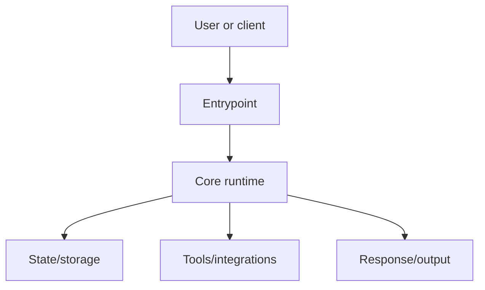

# Repo Expert Onboarding

Use this skill when the user wants to deeply understand a repository, create architecture documentation, onboard from zero to expert, explain how an agent/app/framework works, or generate a complete guide for future contributors.

The goal is not a README summary. The goal is a source-grounded expert guide that explains how the repo works end to end and lets a new engineer reason about behavior, modify it safely, and debug it.

## Operating Rules

- Inspect the repository before explaining it.
- Prefer `rg`, `rg --files`, `git`, package manifests, tests, and source files over assumptions.
- Cite concrete files and line numbers for important claims.
- Keep unrelated repo changes untouched.
- If the user gives an output folder, write all guide files there. Otherwise create `repo-expert-guide/` at the repository root.
- If the repository is remote and not present locally, clone or fetch it only when tools and permissions allow it. Otherwise explain the blocker and proceed from available files.
- If subagent tools are available, use them for independent focused passes. If not, perform the same passes sequentially yourself.
- Do not rely only on `README`, docs, or release notes. Treat them as orientation, then verify against code.
- Do not invent missing behavior. Mark unknowns explicitly and explain how to verify them.
- Qualify behavior by entrypoint and deployment mode. Never imply that Gateway, embedded, CLI, worker, test, and container paths behave identically without evidence.
- Treat tests as behavioral evidence, especially for edge cases and compatibility behavior. When prose, source, tests, and examples disagree, document the disagreement.
- Avoid unsupported absolutes such as "all", "every", "never", "secure", or "isolated". Prove them with an inventory or narrow the claim.

## Required Output

Create a multi-file guide with an index. A typical output structure:

```text
repo-expert-guide/
|-- README.md
|-- 01-big-picture.md
|-- 02-setup-entrypoints-and-configuration.md
|-- 03-runtime-flow.md
|-- 04-core-domain-model.md
|-- 05-state-storage-memory-and-context.md
|-- 06-tools-integrations-and-extension-points.md
|-- 07-user-interfaces-apis-and-clients.md
|-- 08-security-permissions-and-trust-model.md
|-- 09-testing-debugging-and-observability.md
|-- 10-change-playbooks.md
|-- appendix-code-map.md
`-- appendix-coverage-and-evidence.md
```

Adjust file names to the repository. For example, an AI agent repo should have dedicated sections for prompts, context windows, memory, tools, model/provider adapters, agent loop, and gateway/client protocols. A web app should have sections for frontend routing, backend APIs, data model, auth, jobs, deployment, and observability.

## First Pass: Repository Inventory

Run an inventory before deep reading:

```sh
pwd
git status --short
git rev-parse --show-toplevel
git rev-parse HEAD
git branch --show-current
git remote -v
git rev-list --left-right --count HEAD...@{upstream}
rg --files
```

Then identify:

- Languages, package managers, frameworks, and runtime versions.
- Entrypoints: binaries, CLI commands, services, web servers, workers, tests, scripts.
- Top-level directories and ownership boundaries.
- Configuration files and environment variables.
- Generated/vendor/build directories that should not be over-read.
- Tests and examples that demonstrate intended behavior.
- Docs that may already explain architecture.
- Local `HEAD` versus its configured upstream. Fetch only when permitted; never pull over a dirty worktree. Record any known divergence in the guide.

Create a short source map for yourself before writing the final guide.

## Coverage Gate

Before drafting, build a private coverage matrix from the repository inventory. For every first-class package, service, executable, route group, worker, protocol adapter, persistence backend, and UI surface, mark one of:

- deep coverage with a traced flow;
- summarized coverage with source links;
- intentionally omitted with a reason;
- unresolved and requiring investigation.

Do not let the primary happy path consume the entire guide. Trace every major runtime mode, or state explicitly that a mode is not covered. For a large repository, publish the matrix in `appendix-coverage-and-evidence.md`.

Treat a surface as first-class/major when it is independently executable, deployable, publicly routed, operator-configurable, persisted, or backed by its own package/test domain. Treat a repository as large when it has multiple runtime services or more than three such surfaces. The important diagrams are the architecture, end-to-end runtime, and state lifecycle diagrams required above.

Build these inventories when the repository has the corresponding surface:

1. **Topology matrix:** launcher/deployment variant, processes, listeners, public proxy routes, authentication boundary, state backend, sandbox/isolation boundary, and shutdown owner.
2. **Persistence ledger:** logical state, physical location/table, owner or tenant key, secret/content sensitivity, writer and reader, locking/atomicity, retention/deletion/cascade, migration/backup, and multi-process behavior.

## Subagent Strategy

When subagents are available, launch focused agents with bounded tasks. Give each subagent only the repo path, the target output, and its investigation scope. Do not feed them your conclusions unless validating a specific section.

Recommended subagents:

1. Architecture mapper
   - Map top-level modules, boundaries, public APIs, and dependency direction.
   - Find the main execution paths and entrypoints.
   - Return source-backed findings and unresolved questions.

2. Runtime tracer
   - Trace a representative request/task/command from entrypoint to completion.
   - Identify event loops, queues, background jobs, concurrency, retries, cancellation, and error handling.
   - Return a sequence diagram outline.

3. State and data analyst
   - Find databases, files, caches, memory systems, checkpoints, context stores, sessions, and migrations.
   - Produce the persistence ledger, including deletion order, orphaned data, secret-bearing files, locking, and behavior across entrypoints/workers.

4. Tools and integrations analyst
   - Identify external APIs, plugins, MCP/tool systems, SDK wrappers, provider adapters, webhooks, CLIs, and extension points.
   - Explain registration, discovery, execution, permissions, and result handling.

5. Security and operations reviewer
   - Identify auth, authorization, secret handling, sandboxing, permission prompts, network boundaries, input validation, file safety, and prompt-injection defenses.
   - Enumerate public routes from proxy/deployment configuration and find direct-service bypasses, missing/null ownership, global mutable resources, subprocess environment exposure, SSRF/upload limits, TLS, and default-off controls.
   - Identify logging, metrics, debug tools, health checks, deployment, upgrade/rollback, and service management.

6. Documentation critic
   - After the guide draft exists, independently check it for unsupported claims, missing important files, unclear diagrams, stale paths, and gaps.
   - Check alternate entrypoints and tests for contradictions. Challenge every security, persistence, retry, cancellation, rollback, cleanup, and isolation claim.

Run the critic on the draft without giving it your conclusions. If capacity permits, use a separate critic for security/deployment because happy-path architecture reviews routinely miss exposed control planes and unsafe defaults.

Useful subagent prompt template:

```text
You are analyzing the repository at: <absolute_repo_path>

Scope: <specific scope>

Return:
1. The main files/directories for this scope.
2. The important runtime/data flows.
3. Source-backed facts with file paths and line references. Use tests as evidence for edge behavior.
4. Gaps or uncertainty.
5. Sections that should appear in an expert onboarding guide.

Do not summarize README only. Verify against source code.
Do not modify files.
```

## Deep Investigation Checklist

Answer these questions before writing:

- What problem does this repo solve?
- What are the main runtime modes?
- What are the executable entrypoints?
- Which launchers and deployment manifests produce materially different topologies?
- What happens from user input/request/command to final output?
- What are the core abstractions and data structures?
- Where is state stored?
- How is context assembled, mutated, compressed, cached, or persisted?
- How are external tools or services registered, selected, called, retried, and reported?
- How are permissions, secrets, auth, and unsafe actions controlled?
- How does configuration flow from files/env/CLI/UI into runtime behavior?
- What are the extension points?
- What is synchronous, asynchronous, background, or scheduled?
- How are errors classified and recovered?
- What can fail after state is persisted but before work starts?
- What do cancellation, retry, timeout, rollback, reconnect, and crash recovery actually guarantee, and what side effects can continue?
- How are logs, traces, metrics, test fixtures, and debug tools used?
- Which public routes bypass the primary application/authentication layer?
- Which resources are global, shared, ownerless, legacy-compatible, or keyed differently across storage planes?
- What is deleted, retained, or orphaned when a user-visible object is removed?
- What should a new engineer read first?
- What files are risky to modify without understanding their callers?
- What common changes will future contributors likely make?

For AI-agent repositories, also answer:

- What is the agent loop?
- How are system/developer/user/tool messages represented?
- How is prompt/context construction performed?
- How are token budgets handled?
- How is memory retrieved, written, summarized, or forgotten?
- At exactly which turns and entrypoints is memory/context refreshed, frozen, or omitted?
- What happens when summarization, context conversion, or memory extraction fails?
- How are tools exposed to the model?
- How are tool calls executed and returned to the model?
- Are oversized tool results truncated, persisted, previewed, redacted, or retained?
- How are providers like OpenAI, Anthropic, local models, or gateways abstracted?
- What protocol adapters exist, such as ACP, MCP, LSP, webhooks, chat platforms, or editor clients?
- What is the difference between agent, client, editor, provider, gateway, and tool in this repo's vocabulary?

## Guide Writing Requirements

Every guide should include:

- An index with a recommended reading path.
- A big-picture architecture diagram.
- At least one end-to-end runtime sequence diagram.
- A state/context/data lifecycle diagram when the repo stores meaningful state.
- A source map table listing important directories and files.
- At least five short, exact source excerpts for a large repository, spanning composition, runtime context, persistence, execution/tooling, and authorization. Use fewer proportionally for a small repository. Put a `Source:` link within six lines of each excerpt and explain its invariant.
- Explanation of configuration, environment variables, and entrypoints.
- Explanation of tests and how to validate changes.
- A change playbook for common modifications.
- A glossary of repo-specific vocabulary if the repo has domain terms.
- A final "expert checklist" that tells the reader what they should understand.
- A coverage/evidence appendix containing the subsystem matrix, known unknowns, stale or contradictory repo docs, and intentionally omitted areas.

Keep distinct stores and control planes distinct in prose and diagrams. Do not merge concepts into labels such as "database/stores" when they have different owners or lifecycles. Follow every important diagram with an edge-evidence table that maps each edge to the concrete interface and source location.

Use Mermaid for diagrams:



Use concise snippets:

```python
# Keep snippets short and explain why this code matters.
def important_entrypoint(...):
    ...
```

Prefer file links in final status messages. Inside the guide, use relative links between guide files and source paths when useful.

## Suggested Guide Sections

### README.md

Include:

- What the guide covers.
- Repository commit analyzed.
- Branch (or `detached`), analyzed date, dirty state, and `Upstream divergence: ahead N, behind N`; say `unknown` when it could not be checked and note that unfetched tracking refs may be stale.
- Reading path from beginner to expert.
- Section index.
- Top 10 files/directories to understand first.
- Warning about any generated/vendor directories skipped.

### 01 Big Picture

Include:

- Repository purpose.
- Main runtime modes.
- Topology matrix for launch/deployment variants.
- Main actors: users, clients, services, providers, workers, tools.
- Architecture diagram.
- Vocabulary.

### 02 Setup, Entrypoints, And Configuration

Include:

- How the project is installed/run.
- CLI commands, services, web servers, workers, jobs, scripts.
- Config precedence: defaults, config files, env vars, CLI flags, UI settings.
- Secret interpolation and whether mutation paths preserve placeholders and unknown fields.
- Hot-reload versus restart behavior per setting group.
- Important manifests.
- Minimal local run path and common failure modes.

### 03 Runtime Flow

Include:

- End-to-end request/command/task lifecycle.
- Main call stack with file references.
- Async/concurrency model.
- Error handling and retries.
- Admission-before-execution failures, disconnect/reconnect, cancellation, rollback, interrupts/resume, crash recovery, cleanup, and side effects that outlive cancellation.
- Sequence diagram.

### 04 Core Domain Model

Include:

- Core classes, types, schemas, protocols, and interfaces.
- How data moves between them.
- Invariants the code relies on.
- Where abstractions are thin wrappers versus real ownership boundaries.

### 05 State, Storage, Memory, And Context

Include:

- Databases, file stores, caches, sessions, memory systems, indexes, queues.
- Read/write lifecycle.
- Retention and cleanup.
- Deletion order, cascades, orphaned records/files, locking/atomicity, backup/restore, and multi-worker behavior.
- Migration/versioning.
- For agent repos: context construction, summarization/compression, retrieval, memory writes, and prompt boundaries.

### 06 Tools, Integrations, And Extension Points

Include:

- Plugin systems.
- Tool registries.
- External APIs.
- Provider adapters.
- Protocol adapters.
- Extension lifecycle: discover, register, configure, call, return result, handle failure.
- Concrete source-backed configuration examples and permission/timeout/cancellation/secret behavior for each major extension family.

### 07 UIs, APIs, And Clients

Include:

- Web UI, desktop UI, CLI, editor integrations, API clients, chat platforms, or protocol clients.
- What each client owns and what the backend owns.
- Transport formats and event streams.
- Behavioral differences across browser, API, embedded, CLI/TUI, worker, editor, and messaging clients.

### 08 Security, Permissions, And Trust Model

Include:

- Authn/authz.
- Secret loading and redaction.
- Sandbox or approval model.
- File/network/process boundaries.
- Prompt injection or untrusted content handling.
- Risky operations and guardrails.
- Public ingress and direct-service routes, TLS assumptions, global/shared mutation, missing/null owner compatibility, subprocess environment/log exposure, SSRF and upload boundaries, resource limits, and default-disabled protections.

### 09 Testing, Debugging, And Observability

Include:

- Test layout and how to run targeted tests.
- Logs and debug commands.
- Metrics/tracing/health checks.
- Fixtures and mocked services.
- How to debug common failures.
- CI workflow/path-filter map, release/container checks, and an exact runnable command for every named test suite.

### 10 Change Playbooks

Include practical recipes:

- Add a new command/route/tool/provider/plugin.
- Add a new config option.
- Add a new persisted field or migration.
- Add tests for a core behavior.
- Debug a failed runtime path.
- Upgrade an external dependency or protocol.
- Upgrade, migrate, back up, restore, and roll back persisted data/configuration.

### Appendix Code Map

Include:

- File/directory map.
- One-line reason each important file exists.
- "Read first" and "read later" ordering.

### Appendix Coverage And Evidence

Include:

- Published subsystem coverage matrix.
- Topology matrix and persistence ledger, or links to their full sections.
- Important diagram-edge evidence.
- Known unknowns, source/test/doc contradictions, and intentionally omitted areas.
- Snapshot freshness and upstream divergence.

## Validation Pass

Before final response, run the bundled validator:

```sh
python3 <skill-dir>/scripts/validate_guide.py \
  --repo <repo-root> \
  --guide <guide-dir> \
  --min-files <expected-guide-file-count> \
  --min-diagrams <2-or-3> \
  --min-source-snippets <2-or-5> \
  --require-metadata \
  --require-head-match \
  --check-upstream
```

Use three diagrams when meaningful state exists, otherwise two. Use five source excerpts for a large/multi-service repository and two for a small repository. Set `--min-files` to the required structure chosen before drafting; when reviewing an existing guide, derive it from this skill's adapted required sections, not from the number of files already present. Do not lower thresholds to make validation pass.

Then complete the semantic checks below:

1. Check that every guide file in the index exists.
2. Check for placeholders:

```sh
rg -n "T[O]DO|T[B]D|F[I]XME|P[L]ACEHOLDER|\\?\\?\\?" repo-expert-guide
```

3. Check that claimed source files and non-linked backticked paths exist. The validator checks local inline Markdown links, heading/line anchors, and exact README index links; manually inspect reference-style links and ambiguous shorthand paths.

```sh
rg -n "`[^`]+\\.(py|ts|tsx|js|go|rs|java|kt|rb|php|cs|cpp|c|h|yaml|yml|toml|json)`" repo-expert-guide
```

Then spot-check important paths manually.

4. Run lightweight project validation when safe:
   - Existing docs tests or link checks.
   - Formatting for generated markdown if tooling exists.
   - Targeted unit tests only when they are quick and do not require network/secrets.

5. Re-read the guide as a new contributor:
   - Can they explain the system in 5 minutes?
   - Can they trace one complete runtime path?
   - Can they find where to add a feature?
   - Can they identify state, security boundaries, and debugging tools?

6. Run a contradiction pass:
   - For claims not explicitly scoped to one mode, compare against at least one alternate entrypoint or deployment mode.
   - Compare failure/security claims against focused tests and default configuration.
   - Verify diagram ownership and every edge-evidence row.
   - Search for `all`, `every`, `never`, `secure`, `isolated`, and `resumable`; prove or qualify each occurrence.

## Final Response Contract

End with a concise summary:

- Output folder path.
- Commit analyzed.
- Known upstream divergence or inability to check it.
- Sections created.
- The most important architecture findings.
- Validation performed and anything that could not be run.
- Current git status for generated docs.

Do not paste the full guide into chat unless the user asks. Point to the generated files.
